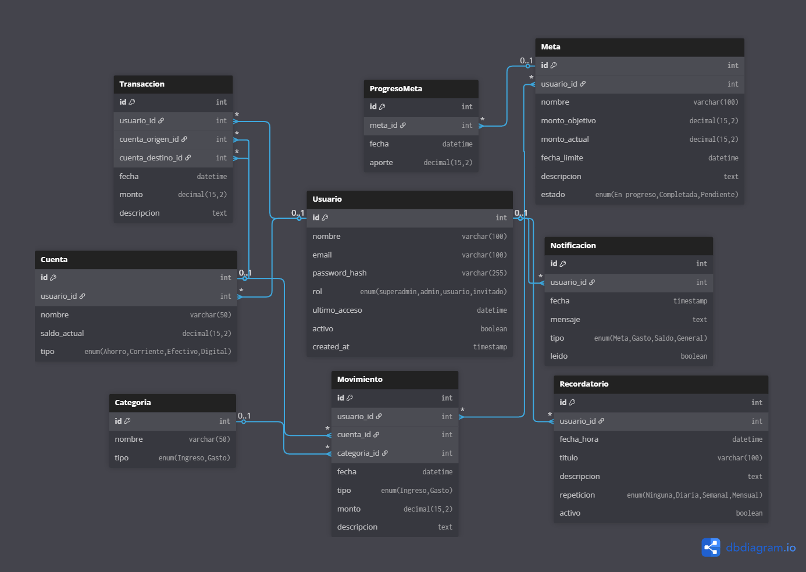

# Documentación del Proyecto: Base de Datos "MoneyFluxTracker" (MFT)

**Versión del Documento:** 1.0  
**Fecha:** Semana 21 - 25 de julio de 2025

---

## Tabla de Contenido

1. [Resumen](#1-resumen)
2. [Diseño de la Base de Datos](#2-diseño-de-la-base-de-datos)
    - [Principios de Diseño](#21-principios-de-diseño-aplicados)
    - [Tablas](#22-tablas)
    - [Diagrama ER](#diagrama-entidad-relacion)
    - [Script SQL](#23-script-sql)
3. [Mejoras Futuras](#3-mejoras-futuras)
4. [Mejoras Implementadas](#mejoras-implementadas)


---

## 1. Resumen

MoneyFluxTracker (MFT) es una aplicación de finanzas personales diseñada para proporcionar claridad, control y fomentar buenos hábitos financieros. El núcleo de la aplicación es una base de datos relacional robusta que registra ingresos, gastos, cuentas, metas de ahorro y recordatorios.


---

## 2. Diseño de la Base de Datos

### 2.1. Principios de Diseño Aplicados

- **Normalización:** Sin redundancia de datos; `Categoria` define el tipo de movimiento.
- **Nomenclatura:** Tablas y columnas en español, con nombres lógicos.
- **Tipos de Dato:**
  - `DECIMAL(15,2)` para montos.
  - `DATETIME` para fechas.
  - `BOOLEAN` para valores lógicos.

---

### 2.2. Tablas

- **Usuario:** Datos de usuario.
- **Cuenta:** Fuentes de dinero (efectivo, banco, digital).
- **Categoria:** Clasificación de movimientos.
- **Movimiento:** Ingresos y gastos.
- **Transaccion:** Transferencias entre cuentas.
- **Meta:** Objetivos de ahorro.
- **ProgresoMeta:** Aportes a metas.
- **Notificacion:** Mensajes al usuario.
- **Recordatorio:** Eventos o pagos futuros.

---

## Diagrama Entidad Relacion



*Figura 1: Diagrama entidad-relación de la base de datos MFT.*

---

### 2.3. Script SQL

Script para crear la base de datos y tablas principales.

```sql
-- Creación de la base de datos si no existe
CREATE DATABASE IF NOT EXISTS MoneyFluxTrackerDB;

-- Usar la base de datos
USE MoneyFluxTrackerDB;

-- -----------------------------------------------------
-- Tabla Usuario
-- -----------------------------------------------------
CREATE TABLE IF NOT EXISTS Usuario (
  id INT PRIMARY KEY AUTO_INCREMENT,
  nombre VARCHAR(100) NOT NULL,
  email VARCHAR(100) NOT NULL UNIQUE,
  password_hash VARCHAR(255) NOT NULL,
  rol ENUM('superadmin', 'admin', 'usuario', 'invitado') NOT NULL DEFAULT 'usuario',
  activo BOOLEAN NOT NULL DEFAULT TRUE,
  fecha_ultimo_acceso DATETIME NULL,
  fecha_creacion DATETIME NOT NULL DEFAULT CURRENT_TIMESTAMP
);

-- -----------------------------------------------------
-- Tabla Cuenta
-- -----------------------------------------------------
CREATE TABLE IF NOT EXISTS Cuenta (
  id INT PRIMARY KEY AUTO_INCREMENT,
  usuario_id INT NOT NULL,
  nombre VARCHAR(50) NOT NULL,
  saldo_actual DECIMAL(15, 2) NOT NULL DEFAULT 0.00,
  tipo ENUM('Ahorro', 'Corriente', 'Efectivo', 'Digital') NOT NULL,
  FOREIGN KEY (usuario_id) REFERENCES Usuario(id) ON DELETE CASCADE
);

-- -----------------------------------------------------
-- Tabla Categoria
-- -----------------------------------------------------
CREATE TABLE IF NOT EXISTS Categoria (
  id INT PRIMARY KEY AUTO_INCREMENT,
  nombre VARCHAR(50) NOT NULL UNIQUE,
  tipo ENUM('Ingreso', 'Gasto') NOT NULL
);

-- -----------------------------------------------------
-- Tabla Movimiento
-- -----------------------------------------------------
CREATE TABLE IF NOT EXISTS Movimiento (
  id INT PRIMARY KEY AUTO_INCREMENT,
  usuario_id INT NOT NULL,
  cuenta_id INT NOT NULL,
  categoria_id INT NOT NULL,
  fecha_hora DATETIME NOT NULL,
  monto DECIMAL(15, 2) NOT NULL,
  descripcion TEXT,
  FOREIGN KEY (usuario_id) REFERENCES Usuario(id) ON DELETE CASCADE,
  FOREIGN KEY (cuenta_id) REFERENCES Cuenta(id),
  FOREIGN KEY (categoria_id) REFERENCES Categoria(id)
);

-- -----------------------------------------------------
-- Tabla Transaccion
-- -----------------------------------------------------
CREATE TABLE IF NOT EXISTS Transaccion (
  id INT PRIMARY KEY AUTO_INCREMENT,
  usuario_id INT NOT NULL,
  cuenta_origen_id INT NOT NULL,
  cuenta_destino_id INT NOT NULL,
  fecha_hora DATETIME NOT NULL,
  monto DECIMAL(15, 2) NOT NULL,
  descripcion TEXT,
  FOREIGN KEY (usuario_id) REFERENCES Usuario(id) ON DELETE CASCADE,
  FOREIGN KEY (cuenta_origen_id) REFERENCES Cuenta(id),
  FOREIGN KEY (cuenta_destino_id) REFERENCES Cuenta(id)
);

-- -----------------------------------------------------
-- Tabla Meta
-- -----------------------------------------------------
CREATE TABLE IF NOT EXISTS Meta (
  id INT PRIMARY KEY AUTO_INCREMENT,
  usuario_id INT NOT NULL,
  nombre VARCHAR(100) NOT NULL,
  monto_objetivo DECIMAL(15, 2) NOT NULL,
  monto_actual DECIMAL(15, 2) NOT NULL DEFAULT 0.00,
  fecha_hora_limite DATETIME NULL,
  descripcion TEXT,
  estado ENUM('En progreso', 'Completada', 'Pendiente') NOT NULL DEFAULT 'Pendiente',
  FOREIGN KEY (usuario_id) REFERENCES Usuario(id) ON DELETE CASCADE
);

-- -----------------------------------------------------
-- Tabla ProgresoMeta
-- -----------------------------------------------------
CREATE TABLE IF NOT EXISTS ProgresoMeta (
  id INT PRIMARY KEY AUTO_INCREMENT,
  meta_id INT NOT NULL,
  fecha_hora DATETIME NOT NULL,
  aporte DECIMAL(15, 2) NOT NULL,
  FOREIGN KEY (meta_id) REFERENCES Meta(id) ON DELETE CASCADE
);

-- -----------------------------------------------------
-- Tabla Notificacion
-- -----------------------------------------------------
CREATE TABLE IF NOT EXISTS Notificacion (
  id INT PRIMARY KEY AUTO_INCREMENT,
  usuario_id INT NOT NULL,
  mensaje TEXT NOT NULL,
  tipo ENUM('Meta', 'Gasto', 'Saldo', 'General') NOT NULL,
  leido BOOLEAN NOT NULL DEFAULT FALSE,
  fecha_creacion DATETIME NOT NULL DEFAULT CURRENT_TIMESTAMP,
  FOREIGN KEY (usuario_id) REFERENCES Usuario(id) ON DELETE CASCADE
);

-- -----------------------------------------------------
-- Tabla Recordatorio
-- -----------------------------------------------------
CREATE TABLE IF NOT EXISTS Recordatorio (
  id INT PRIMARY KEY AUTO_INCREMENT,
  usuario_id INT NOT NULL,
  titulo VARCHAR(100) NOT NULL,
  descripcion TEXT,
  fecha_hora_recordatorio DATETIME NOT NULL,
  repeticion ENUM('Ninguna', 'Diaria', 'Semanal', 'Mensual') NOT NULL DEFAULT 'Ninguna',
  activo BOOLEAN NOT NULL DEFAULT TRUE,
  FOREIGN KEY (usuario_id) REFERENCES Usuario(id) ON DELETE CASCADE
);
```

---

## 3. Mejoras Futuras

- Unificación de movimientos y transacciones en una sola tabla (`Operacion`).
- Automatización de operaciones recurrentes.
- Sistema de presupuestos por categoría y periodo.
- Modelado detallado de deudas y activos.

---
# Documentación del Proyecto: Base de Datos "MoneyFluxTracker" (MFT)
**Versión del Documento:** 2.0  
**Fecha:** semana del 28 de julio al 01 agosto de 2025

# Mejoras Implementadas 
-

### Mejora #1: Fusión de `Movimiento` y `Transaccion`

**Objetivo:** Eliminar la redundancia y simplificar la lógica de la aplicación para consultar el historial financiero del usuario.

**Implementación:**

Las tablas `Movimiento` y `Transaccion` fueron **eliminadas** y reemplazadas por una única tabla central: **`Operacion`**.

*   **Tabla `Operacion`**: Ahora registra cualquier tipo de actividad financiera.
*   **Campo Discriminador `tipo`**: Una columna `ENUM('Ingreso', 'Gasto', 'Transferencia')` determina la naturaleza de cada registro.
*   **Gestión de Cuentas**:
    *   **Ingreso**: `cuenta_origen_id` es `NULL`, `cuenta_destino_id` tiene valor.
    *   **Gasto**: `cuenta_origen_id` tiene valor, `cuenta_destino_id` es `NULL`.
    *   **Transferencia**: `cuenta_origen_id` y `cuenta_destino_id` tienen valor.
*   **Categorías**: El campo `categoria_id` es `NULL` para las transferencias, ya que estas no alteran el patrimonio.

**Ventaja Principal:** Obtener un historial cronológico completo de toda la actividad del usuario ahora requiere una única y simple consulta a la tabla `Operacion`, en lugar de complejas uniones entre dos tablas.

---

### Mejora #2: Modelado de Operaciones Recurrentes

**Objetivo:** Automatizar el registro de operaciones periódicas (salarios, suscripciones, etc.) para reducir la entrada manual de datos y permitir proyecciones financieras precisas.

**Implementación:**

Se introdujo una nueva tabla dedicada exclusivamente a gestionar las **reglas** de automatización, separándolas de los **hechos** ya ocurridos.

*   **Tabla `OperacionRecurrente`**: Actúa como una **fábrica o plantilla** para generar operaciones futuras. Cada fila es una regla.
*   **Campos Clave**:
    *   **Plantilla**: Contiene los datos de la operación a crear (`monto`, `categoria_id`, etc.).
    *   **Reglas de Recurrencia**:
        *   `frecuencia`: Define cuándo se repite la operación (`Mensual`, `Semanal`, etc.).
        *   `fecha_proxima_ejecucion`: Almacena la fecha exacta de la siguiente ejecución, siendo el campo clave para el proceso automático.
        *   `activo`: Permite al usuario pausar o reanudar la recurrencia.


**Ventaja Principal:** La aplicación puede mantener el estado financiero del usuario actualizado automáticamente, proporcionando una experiencia de usuario superior y datos fiables para la planificación futura.

### Mejora #3: Modelado de presupuesto

Un sistema de presupuestos  permite **planificar** 

**"Este mes, decido gastar maximo $200.000 en salidas"**

**1. La Tabla `Presupuesto`**

Esta tabla es el corazón de la funcionalidad. Cada fila representa un límite de gasto que el usuario se impone a sí mismo.
*   **¿Qué  guarda esta tabla?**
    *   **A quién pertenece:** (FK a `Usuario`).
    *   **Sobre qué se presupuesta:** (FK `Categoria`). para crear presupuestos con las categorias.
    *   **Cuál es el límite:** `monto_limite`  valor máximo a gastar.
    *   **Para qué periodo de tiempo:** `periodo` (un `ENUM`  'Semanal', 'Mensual', 'Anual'). 
    *   **Desde cuándo empieza a contar:** `fecha_inicio` (`DATETIME`inicio del primer ciclo del presupuesto).
    *   **¿Está activo?:** `activo` (un `BOOLEAN` para que el usuario pueda pausar un presupuesto sin borrarlo).

**2. La Lógica del Backend (El Cerebro que Calcula)**

`GASTO REAL` vs. `LÍMITE DEL PRESUPUESTO`

Para cada presupuesto activo de un usuario, el backend debe:

*   **Paso A: Calcular el Gasto Real.**
   
*   **Paso B: Obtener el Límite del Presupuesto.**

*   **Paso C: Calcular y Mostrar el Estado.**
   
**Nota:** se ha añadido una restricción `UNIQUE` al final para evitar que un usuario cree por error dos presupuestos mensuales para la misma categoría, lo que no tendría sentido.
